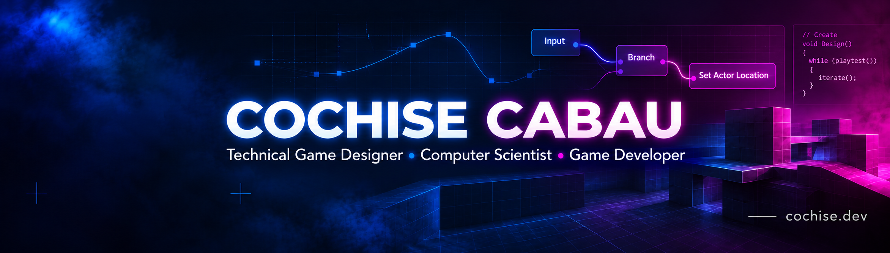
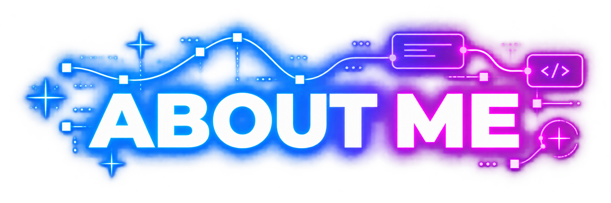
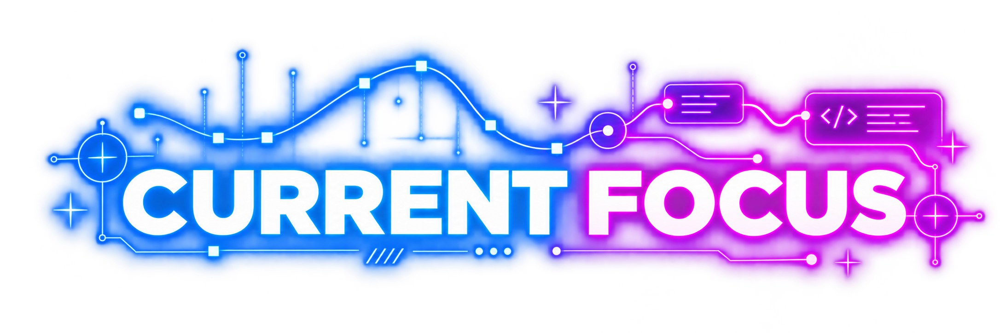
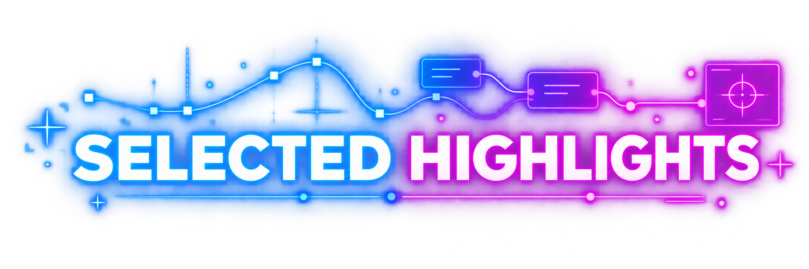
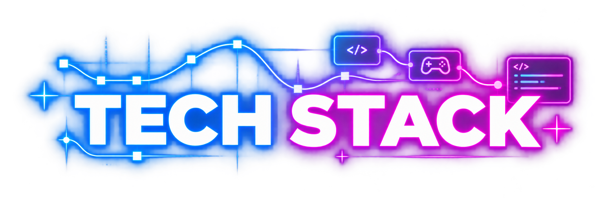
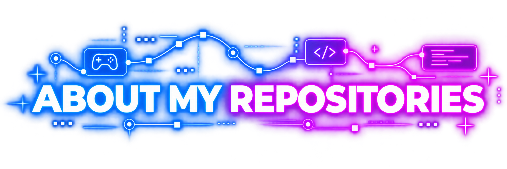
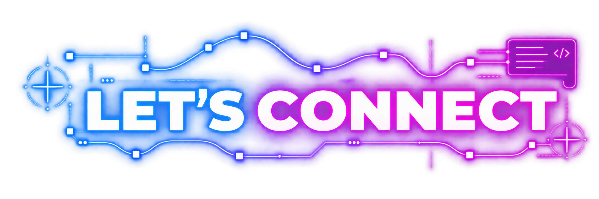

  

  
  
  

 

  

I'm a **Technical Game Designer** and Computer Science & Video Game Development double-degree student based in Madrid, focused on the intersection between **game design and programming**.

I enjoy taking mechanics from an idea to a playable implementation, testing them, and iterating until they feel right.

My experience includes:

- Gameplay systems and prototyping
- Systems and game design
- Level and environment design
- UI / HUD systems
- AI and state machines
- Input and camera systems
- Multiplayer and networking
- VR development
- Tools and technical workflows

I mainly work with **Unity and Unreal Engine**, with a strong programming foundation in **C++, C#, Python and Java**.

 

  

🎮 **Technical Game Design**  
🕹️ Gameplay Programming  
🧩 Systems Design  
🗺️ Technical Level Design  
🛡️ Anti-cheat & Game Security

I'm especially interested in roles where I can bridge **design and implementation**.

 

  

- 🥇 **1st Place — Band Fusion**, University Game Jam 2025
- 🥈 **2nd Place — Nature Appliances**, University Game Jam 2024
- 🥈 **2nd Place — BRAKELESS**, Madrid in Game Hack Jam 2026
- 🎸 **Band Fusion showcased at Río Babel Music Festival 2025**
- 🎮 **Band Fusion showcased at Japan Weekend 2026**
- 🏁 Fastest finisher of the **Hackr0cks 3-day CTF 2026**

 

  

### Game Development

### Programming

### Workflow

 

  

> **Most of my university coursework and academic projects are private at the request of the university.**

As a result, the number of public repositories here does **not represent the full scope of my development experience**.

For playable projects, case studies and a broader look at my work:

  
  

 

  

  
  
  

  <b>Designing systems. Building them. Iterating until they feel right.</b>

